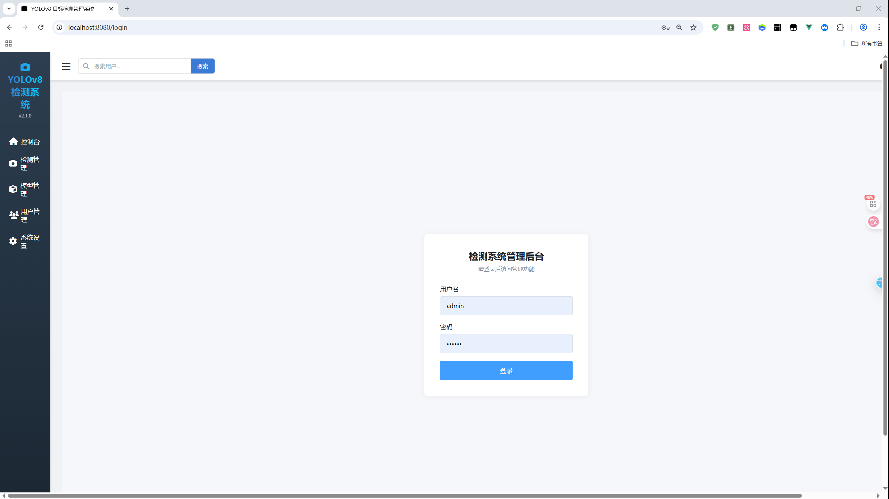
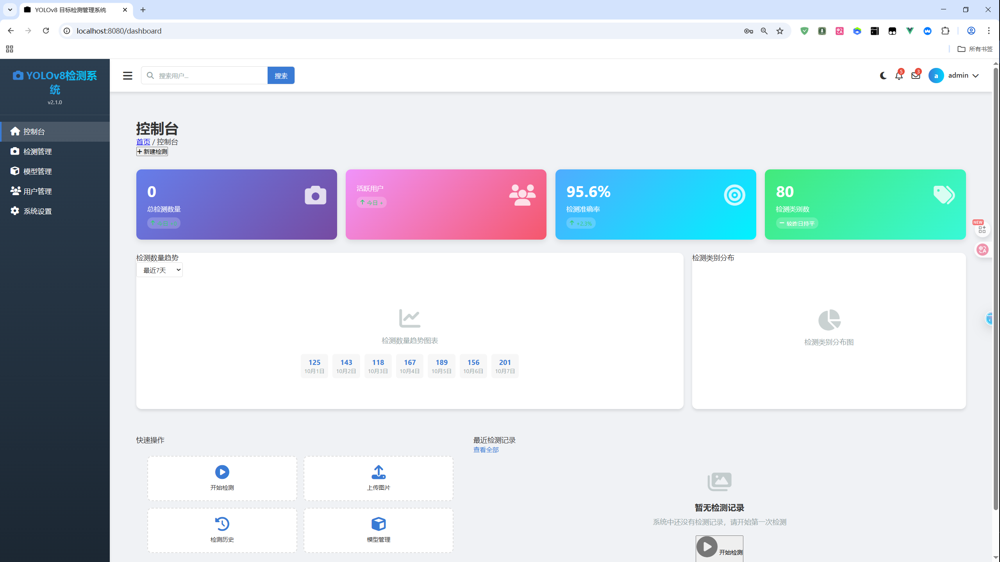
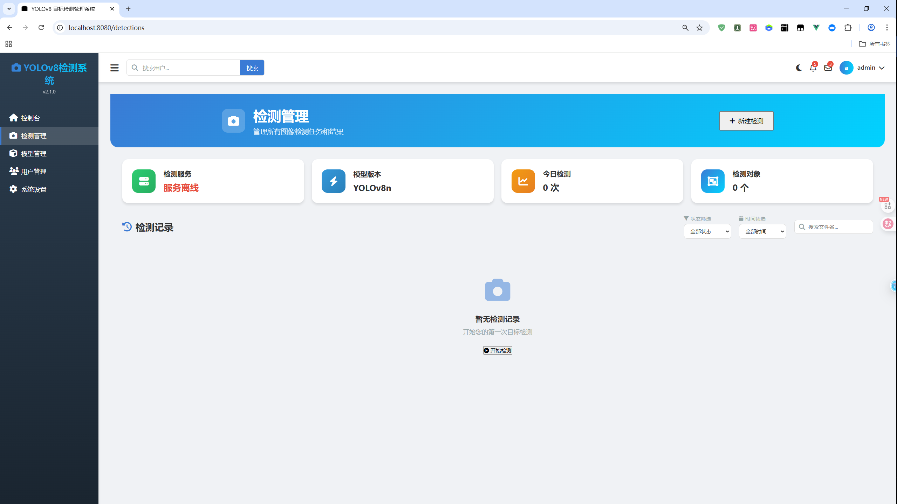
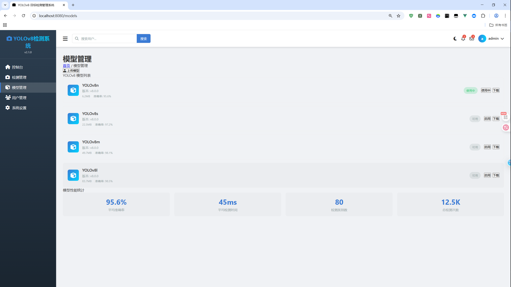
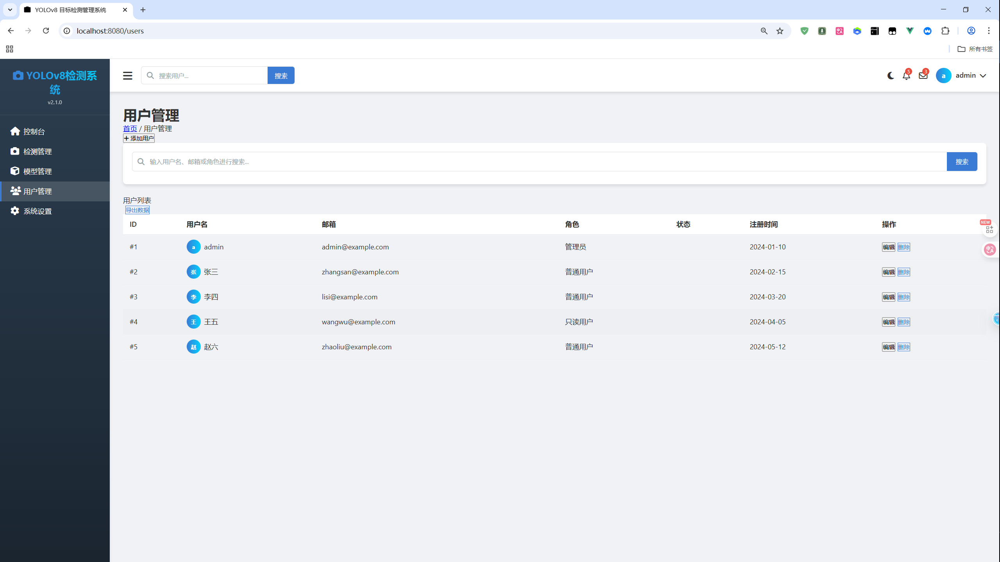
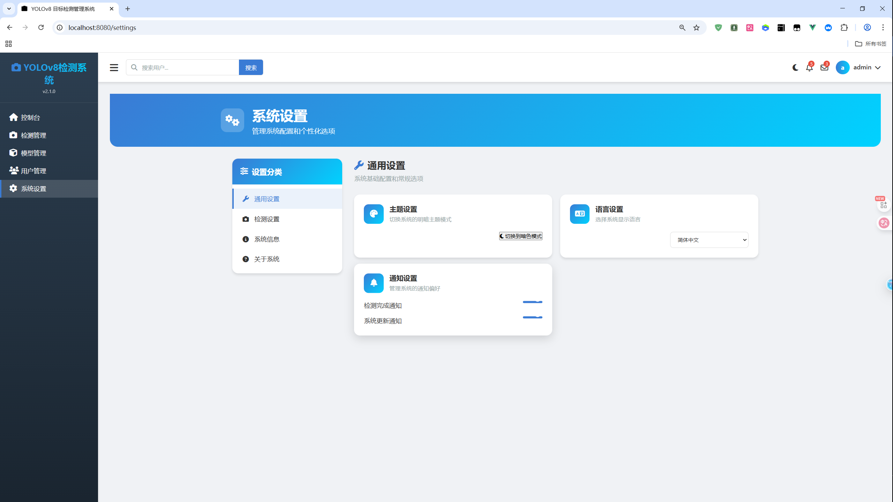

# YOLOv8 + Vue3 目标检测后台管理系统

## 项目简介

YOLOv8 + Vue3 目标检测后台管理系统是一个现代化的全栈应用，集成了前沿的计算机视觉技术和现代Web开发框架。系统采用前后端分离架构，前端基于Vue3生态构建直观的可视化操作界面，后端使用FastAPI集成YOLOv8模型提供高效的目标检测能力。

本系统专为需要管理图像检测任务、分析检测结果和监控检测性能的场景设计，适用于安防监控、工业质检、智能交通、医疗影像分析等多个领域。

## 🌟 系统预览

- **前端地址**: http://localhost:3000 (开发环境)
- **后端地址**: http://localhost:8000 (开发环境)
- **默认账号**: 管理员 (演示模式，无需密码)
- **支持格式**: JPG、PNG，最大10MB文件

## 页面展示
- **管理员登录**: 
- **控制台页面**: 
- **检测管理页面**:
- **模型管理页面**:
- **用户管理页面**:
- **系统设置页面**:

## 🚀 核心功能

### 1. 智能目标检测模块
- **实时图像检测**: 支持拖拽上传和点击上传两种方式
- **YOLOv8集成**: 集成最新的YOLOv8n模型，识别80+种常见对象
- **可视化结果**: 实时显示检测边界框、类别标签和置信度
- **批量处理**: 支持连续上传多张图片进行检测
- **性能监控**: 实时显示推理时间和检测统计

### 2. 检测记录管理
- **历史追踪**: 完整的检测记录存储和检索系统
- **智能筛选**: 支持按状态(成功/失败)、时间范围、对象类别筛选
- **统计仪表板**: 实时展示总检测数、今日检测量、准确率趋势
- **数据导出**: 支持检测结果JSON格式导出
- **详情查看**: 点击记录查看完整的检测信息和可视化结果

### 3. 用户认证与权限管理
- **安全登录**: 基于Token的身份验证机制
- **路由守卫**: 自动拦截未授权访问，重定向至登录页
- **状态持久化**: 支持页面刷新后自动恢复登录状态
- **权限控制**: 基于角色的访问控制(管理员、操作员、查看者)

### 4. 用户信息管理
- **个人信息**: 当前用户资料展示和编辑
- **用户统计**: 系统用户数量、活跃度等统计信息
- **搜索筛选**: 支持按姓名、邮箱、角色快速查找用户
- **状态管理**: 用户活跃状态监控和管理

### 5. 系统监控与设置
- **服务健康**: 实时监控前后端服务运行状态
- **主题切换**: 支持明暗主题一键切换
- **响应式设计**: 完美适配桌面端、平板和移动设备
- **性能优化**: 懒加载、图片压缩、请求缓存等优化措施

## 🛠 技术架构

### 前端技术栈
- **核心框架**: Vue 3.3.4 + Composition API
- **构建工具**: Vite 4.3.9 (极速冷启动)
- **状态管理**: Pinia 2.1.4 (轻量级状态管理)
- **路由管理**: Vue Router 4.2.4
- **HTTP客户端**: Axios (Promise-based HTTP client)
- **UI组件**: 自定义组件 + Font Awesome 6 图标库
- **样式方案**: CSS3 + CSS变量 (主题切换支持)
- **开发工具**: ESLint + Prettier (代码规范)

### 后端技术栈
- **Web框架**: FastAPI (高性能Python Web框架)
- **AI引擎**: YOLOv8 (Ultralytics)
- **图像处理**: OpenCV 4.x
- **异步服务器**: Uvicorn (基于uvloop的ASGI服务器)
- **数据验证**: Pydantic (类型注解数据验证)
- **CORS支持**: 完整的跨域资源共享配置
- **日志系统**: 结构化日志记录

### 部署架构
```
前端 (Vue3) ← HTTP/WebSocket → 后端 (FastAPI) ← 模型调用 → YOLOv8
    ↓                              ↓
   CDN                          ASGI服务器
    |                              |
  用户浏览器 ← 响应数据 → 图像处理管道
```

## 📋 环境配置指南

### 系统要求
- **Node.js**: 16.0 或更高版本
- **Python**: 3.8 或更高版本
- **内存**: 4GB+ (推荐8GB)
- **存储**: 2GB+ 可用空间
- **GPU**: 支持CUDA的GPU (可选，用于加速检测)

### 快速开始

#### 第一步：获取项目代码
```bash
# 克隆项目到本地
git clone <项目仓库地址>
cd my-vue-admin
```

#### 第二步：前端环境配置
```bash
# 安装Node.js依赖
npm install

# 启动开发服务器 (端口3000)
npm run dev

# 构建生产版本
npm run build
```

#### 第三步：后端环境配置
```bash
# 进入后端目录
cd backend

# 创建Python虚拟环境
python -m venv venv

# 激活虚拟环境
# Windows:
venv\Scripts\activate
# Linux/Mac:
source venv/bin/activate

# 安装Python依赖
pip install -r requirements.txt

# 启动后端服务 (端口8000)
python main.py
```

#### 第四步：验证安装
1. 访问 `http://localhost:3000` 查看前端界面
2. 访问 `http://localhost:8000` 验证后端API
3. 上传测试图片进行目标检测验证

## 🔧 故障排除指南

### 常见问题解决方案

#### 1. 前端启动问题
**问题**: npm install 失败
```bash
# 解决方案
npm cache clean --force
npm install --registry=https://registry.npmmirror.com
```

**问题**: 端口被占用
```bash
# 查找占用进程
lsof -i :3000
# 终止进程或更换端口
npm run dev -- --port 3001
```

#### 2. 后端启动问题
**问题**: Python包安装失败
```bash
# 使用国内镜像
pip install -i https://pypi.tuna.tsinghua.edu.cn/simple -r requirements.txt
```

**问题**: YOLOv8模型下载失败
```bash
# 手动下载模型
wget https://github.com/ultralytics/assets/releases/download/v8.0.0/yolov8n.pt
```

#### 3. 前后端连接问题
**问题**: CORS跨域错误
```python
# 在后端main.py中确保CORS配置正确
app.add_middleware(
    CORSMiddleware,
    allow_origins=["http://localhost:3000", "http://127.0.0.1:3000"],
    allow_credentials=True,
    allow_methods=["*"],
    allow_headers=["*"],
)
```

#### 4. 检测功能问题
**问题**: 图片上传失败
- 检查文件格式(JPG/PNG)和大小(<10MB)
- 验证后端文件处理权限
- 查看浏览器控制台错误信息

## 📁 项目结构说明

```
my-vue-admin/
├── public/                 # 静态资源
│   ├── favicon.ico
│   └── index.html
├── src/
│   ├── components/         # 可复用组件
│   │   ├── Header.vue     # 顶部导航栏
│   │   ├── Sidebar.vue    # 侧边栏菜单
│   │   └── Common/        # 通用组件
│   ├── views/             # 页面视图
│   │   ├── Dashboard.vue  # 控制台
│   │   ├── Detections.vue # 检测管理
│   │   ├── Users.vue      # 用户信息
│   │   ├── Models.vue     # 模型管理
│   │   └── Settings.vue   # 系统设置
│   ├── stores/            # 状态管理(Pinia)
│   │   ├── user.js        # 用户状态
│   │   └── detection.js   # 检测状态
│   ├── services/          # API服务层
│   │   └── api.js         # HTTP请求封装
│   ├── router/            # 路由配置
│   │   └── index.js
│   ├── assets/            # 静态资源
│   │   └── styles/        # 全局样式
│   ├── App.vue            # 根组件
│   └── main.js            # 应用入口
├── backend/               # 后端服务
│   ├── main.py           # FastAPI应用入口
│   ├── requirements.txt  # Python依赖
│   └── models/           # 模型文件
├── package.json          # 前端依赖配置
├── vite.config.js        # Vite构建配置
└── README.md            # 项目说明文档
```

## 💡 开发指南

### 添加新功能模块
1. **创建页面组件**: 在 `src/views/` 创建Vue组件
2. **配置路由**: 在 `src/router/index.js` 添加路由规则
3. **添加菜单项**: 在 `src/components/Sidebar.vue` 更新导航菜单
4. **状态管理**: 如需全局状态，在 `src/stores/` 创建store
5. **API集成**: 在 `src/services/api.js` 添加后端接口调用

### 自定义配置
- **主题定制**: 修改 `src/App.vue` 中的CSS变量
- **API配置**: 调整 `src/services/api.js` 中的baseURL
- **模型参数**: 配置 `backend/main.py` 中的检测参数
- **上传限制**: 修改前后端的文件大小和格式验证

### 性能优化建议
- 使用Vue的异步组件实现路由懒加载
- 对大型图片进行压缩和缓存
- 实现检测请求的防抖和取消机制
- 使用Web Worker处理复杂的计算任务

## 🚀 部署方案

### 开发环境部署
```bash
# 前端开发模式
npm run dev

# 后端开发模式
python main.py
```

### 生产环境部署

#### 前端部署
```bash
# 构建生产版本
npm run build

# 部署到静态服务器(Nginx/Apache)
# dist目录包含所有静态资源
```

#### 后端部署
```bash
# 使用生产级ASGI服务器
pip install gunicorn
gunicorn -w 4 -k uvicorn.workers.UvicornWorker main:app

# 或使用Docker部署
docker build -t yolov8-backend .
docker run -p 8000:8000 yolov8-backend
```

### 环境变量配置
创建 `.env` 文件：
```env
# 前端环境变量
VUE_APP_API_URL=http://localhost:8000
VUE_APP_ENV=production

# 后端环境变量
MODEL_PATH=./models/yolov8n.pt
MAX_FILE_SIZE=10485760
```

## 🆘 获取帮助

### 问题排查步骤
1. **查看日志**: 检查前后端控制台输出
2. **网络检查**: 使用浏览器开发者工具检查网络请求
3. **环境验证**: 确认Node.js和Python版本符合要求
4. **依赖检查**: 验证所有依赖包正确安装

### 技术支持
- **项目文档**: 查看项目README和代码注释
- **技术社区**: Vue3、FastAPI、YOLOv8官方社区
- **问题反馈**: 通过GitHub Issues提交问题报告

### 扩展资源
- [Vue3官方文档](https://v3.vuejs.org/)
- [FastAPI官方文档](https://fastapi.tiangolo.com/)
- [YOLOv8文档](https://docs.ultralytics.com/)
- [Pinia状态管理](https://pinia.vuejs.org/)

## 📝 版本更新日志

### v2.0.0 (当前版本)
- ✅ 集成YOLOv8最新模型
- ✅ 完整的用户认证系统
- ✅ 实时检测结果可视化
- ✅ 响应式设计适配移动端
- ✅ 明暗主题切换功能

### 未来版本规划
- 🔄 批量图片检测功能
- 🔄 视频流实时检测
- 🔄 多模型支持切换
- 🔄 检测结果统计分析
- 🔄 用户权限分级管理

---

**重要提示**: 本项目为演示用途，生产环境部署前请进行充分的安全测试和性能优化，包括但不限于：身份认证强化、输入验证、API限流、日志监控、数据加密等措施。

对于企业级应用，建议增加以下功能：
- 数据库持久化存储
- 用户行为审计日志
- 自动备份和恢复机制
- 监控告警系统
- 负载均衡和集群部署